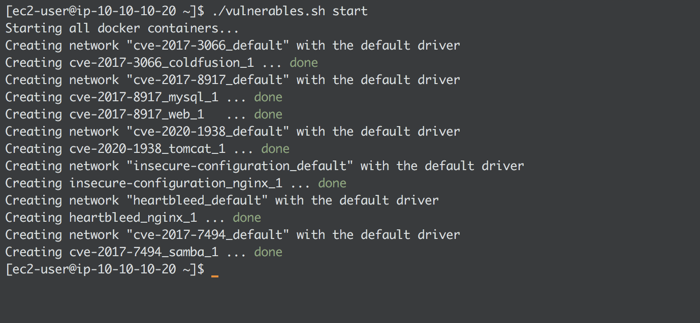

# Vulnerables
A quick way of launching vulnerable docker containers.

By default the script contains **6** vulnerable services running on unique ports to avoid any conflict. There are:

* Coldfusion (CVE-2017-3066) on port `8500`
* Heartbleed (CVE-2014-0160) on ports `80` and `443`
* ActiveMQ (CVE-2016-3088) on ports `61616` and `8161`
* Samba (CVE-2017-7494) on port `445`
* CouchDB (CVE-2017-12636) on port `5984`
* Nginx (misconfiguration) on ports `8080`, `8081` and `8082`

## Requirements 
Download and install the following packages:

* Docker software (https://docs.docker.com/get-docker/)
* Docker-compose utility (https://docs.docker.com/compose/install/)
* Vulhub repository (https://github.com/vulhub/vulhub)

## Running

* Make file executable: `chmod +x vulnerables.sh`
* To start all containers: `./vulnerables.sh start`
* To stop all containers: `./vulnerables.sh stop`

